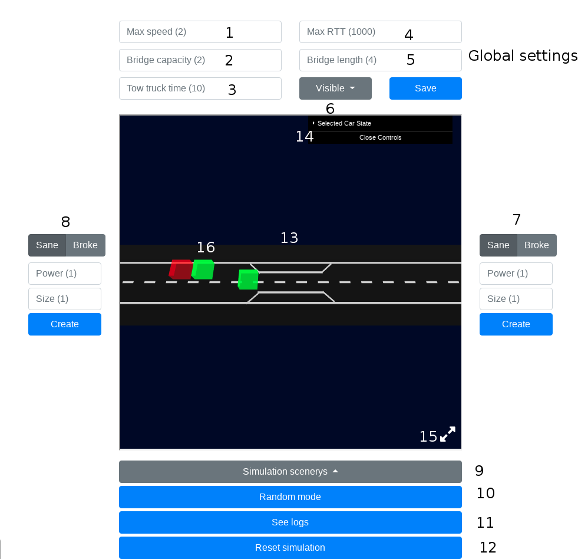

# The Bottleneck Problem - Distributed Systems Project 2019

The aim of this project is the analysis, the implementation and testing of a 
distributed solution for the **bottleneck problem** 
(also know as \textit{The Monkeys Problem}, in operative systems theory).

Basically the problem consists in a two-way road with a **bridge** (bottleneck) 
in the middle, the bridge has a certain **maximum capacity** and can be crossed 
in only **one direction at a time**.

The bridge is **very risky** cause it is located in a remote place where 
there is nothing that can prevent **car crashes/congested traffic** but cars. \\

Note that **cars** here are **autonomous systems** without any human driver
inside and can send messages with others adjacent cars with some wireless technologies 
(ie. bluetooth, wifi, ...) in order to solve the situation.\\    

The projet requires the implementation of a **simulator/business logic** for the 
environment setup and a **web server** that will expose the simulation state 
with some API for any further **UI application**.


## Team 

* Edoardo Lenzi
* Talissa Dreossi


## Get Started

In order to run the project are required Docker-ce, npm and Erlang 19+ 


Fill the credentials (/credentials/credentials.json) with the ssh credentials of your machines:

```{json}
[
    {
        "id": 1,
        "host": "host1",
        "ip": "192.168.130.183",
        "password": "password1"
    }, 
    {
        "id": 2,
        "host": "host2",
        "ip": "192.168.130.37",
        "password": "password2!"
    }
]
```


Build the project

```{sh}
sudo make 
```


Run the project outside docker

```{sh}
sudo make run 
```

> In this way you run the web service outside docker and you can choose to 
run cars inside or outside docker 

Run the project inside docker

```{sh}
sudo make run-docker 
```

> inside docker only cars inside a docker container will work


## User manual



1. Maximum speed allowed (in terms of blocks/turn)
2. Bridge capacity (the maximum number of cars that can cross the bridge at the same time)
3. Tow truck time (elimination time of a broken car in ms)
4. Max RTT allowed (if a car takes more than that time it is considered broken)
5. Bridge length
6. Car scope 
    * Visible: open a gnome-terminal shell with car logs
    * Detached: launch the same command of above but in detached mode
    * Docker: launch the car inside a docker container
7. Manual creation of a new car on the right side
8. Manual creation of a new car on the left side
9. Launch a predefined scenery
10. Enter in random generation mode
11. Open a new tab with a log view
12. Reset simulation (kill every car instance)
13. Simulation canvas (3d interactive canvas)
14. Simulation inspector (open once you select a car with the mouse)
15. Full screen mode
16. Car (select it in order to see its details in the inspector and its power)